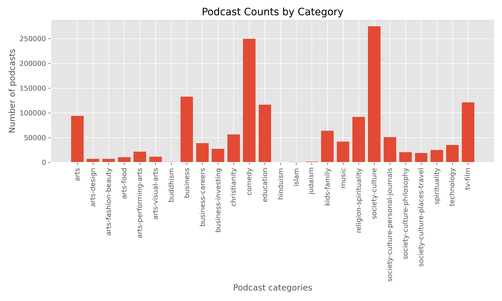
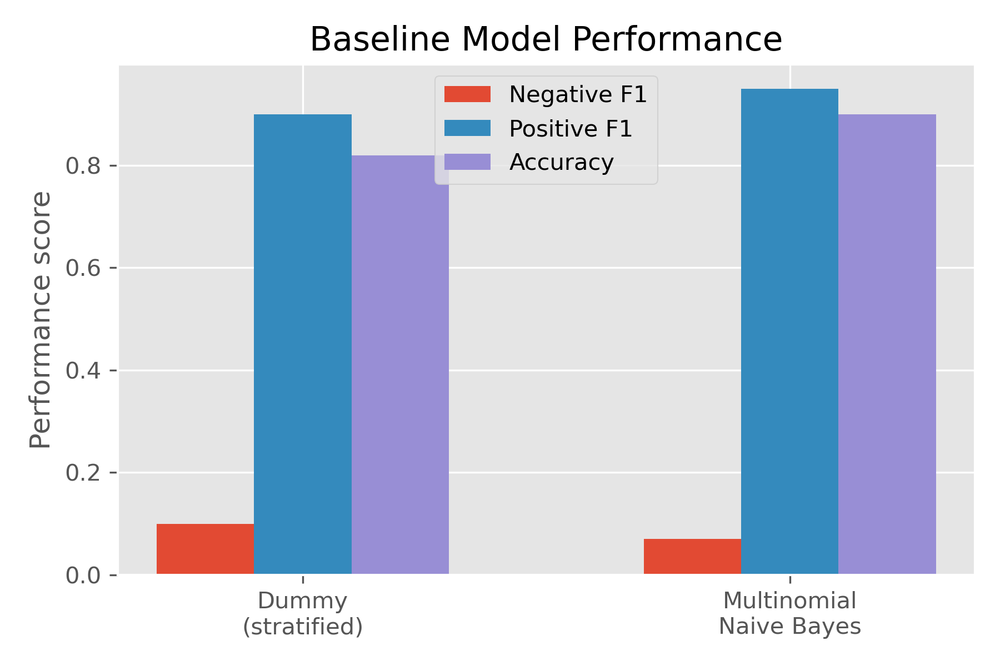

# What's So Funny? Explaining the Joke in Comedy Podcast Reviews
Comedy podcasts make up 3 of the [top 5 most financially successful podcasts](https://www.statista.com/statistics/476423/highest-earning-podcasts-revenue-worldwide/). Podcast ratings for these shows are important for advertisers, given that their products are associated with the podcast in the minds of the listeners. Further, podcast hosts must have a keen sense of how their listeners respond to their shows because positive reviews are critical for gaining popularity in this competitive industry.

Using a [publicly available dataset](https://www.kaggle.com/thoughtvector/podcastreviews) containing more than 1.2 million podcast reviews, this project will build a model that processes the text of user reviews to predict whether they have a positive or negative sentiment towards the show. With a refined model, we'll look at specific text features that contribute an outsized effect for these predictions. This information is useful for advertisers and producers alike, who rely on reviewers (a subset of all podcast listeners) as a source of revunue and word-of-mouth distribution.

# Exploratory Data Analysis
The entire [dataset](https://www.kaggle.com/thoughtvector/podcastreviews) includes 1.2 million reviews from 46k podcasts with 26 different category tags. 

To focus on the particularly popular and successful comedy genre, I selected the 249k reviews affiliated with 8k comedy podcasts.

The reviews include titles (max 100 characters)as well as the full content of the review (max 6000 characters).

As with many rating datasets, there is a heavy class imbalance that skews in favor of 5-star reviews.

# Modeling
To establish a baseline model for comparison and interative improvement, I generated a stratified dummy model and a Multinomial Naive Bayes model.

As expected with such an imbalanced dataset, these preliminary models are poor at predicting the minority class. One simple method to address this issue is to oversample from the minority class for our training data. This, combined with the addition of stop words selected from the most commonly observed terms and incorporation of bigrams into the vectorization process, resulted in substantial model improvement.

# Interpretation

While the Naive Bayes and Linear Support Vector Machine models have similar performance, the latter provides coefficients for individual text features. These coefficients can indicate words that have the strongest effect on the model's determination of negative sentiment about the podcast. This information is relevant for potential advertisers selecting a podcast based on the topics that are commonly discussed on air, or podcast hosts seeking to use a data-driven curation of their topics. 

Other than the features with intrinsically negative connotations, "politics" is the only keyword that sticks out as a strong predictor of negative reviews. Among the strongly positive text features, "life" and "friends" stand out.

Based on our model, comedy podcasts that avoid politics and implement life or friends as topics of conversation would be strong candidates for monetized advertising space where audience sentiment is important.

# Exploring other podcast categories

As a next step, this same analytical pipeline can be applied to other high-earning podcast genres, including business or technology podcasts. A python script (not completed yet) will accept any of the 26 podcast categories and return a Linear SVM model with the top positive and negative text features. Implementing topic modeling function, using Non-negative Matrix Factorization or Latent Dirichlet Allocation, would also be useful for picking out groupings of text that help to parse out reviews.

Here's a peek at the technology positive and negative features.

Political topics seem to be unpopular in this category as well, but user reviews mentioning audio and sound are also strongly related to negative sentiments. Perhaps a special consideration of business podcasts should be the recording quality of the show, which business listeners may be particularly sensitive to (or perhaps business podcasts have poor audio quality in general).